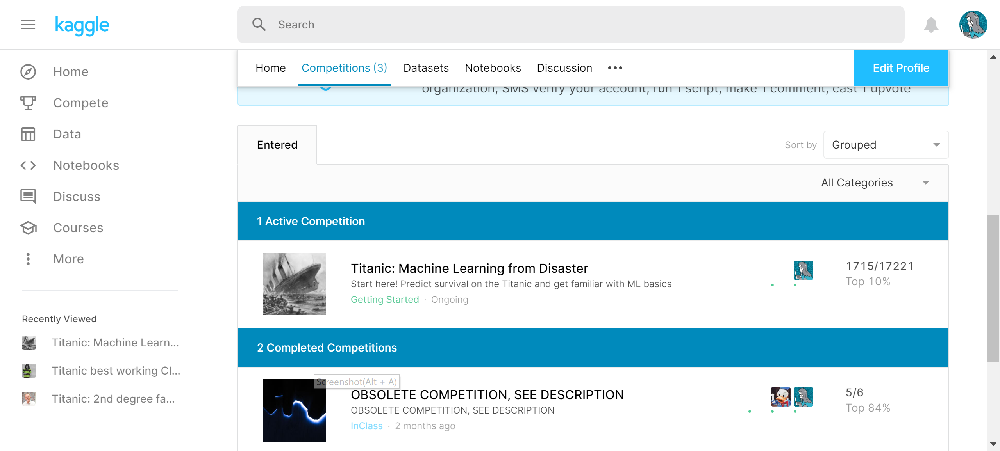

# Titanic_PyTorch

## timeline

| time        | todo                                                         | done |
| ----------- | ------------------------------------------------------------ | ---- |
| 3.23 - 3.28 | data preprocessing                                           | √    |
| 3.25 - 3.28 | validation, try different models(GBDT, RF, SVM, ideas from notebook) | √    |
| 3.27 - 3.30 | ensemble all results([ref](https://www.kaggle.com/yassineghouzam/titanic-top-4-with-ensemble-modeling)) | √    |
| 3.28 - 3.31 | KNN, ensemble two 0.78 cases, try vote, mean, logic          | √    |
| 3.30        | some manual change                                           |      |

| PassengerId |                               |      |
| ----------- | ----------------------------- | ---- |
| Survived    | label，one hot(cross entropy) |      |
| Pclass      | one hot，有明显影响           | √    |
| Name        |                               |      |
| Sex         | one hot，有明显影响           | √    |
| Age         | 分类/分箱，有影响             |      |
| SibSp       | 分类/分箱，有影响             |      |
| Parch       | 分类/分箱，有影响             |      |
| Ticket      |                               |      |
| Fare        | 归一化/分类/分箱，有明显影响  |      |
| Cabin       |                               |      |
| Embarked    | one hot，有影响               |      |